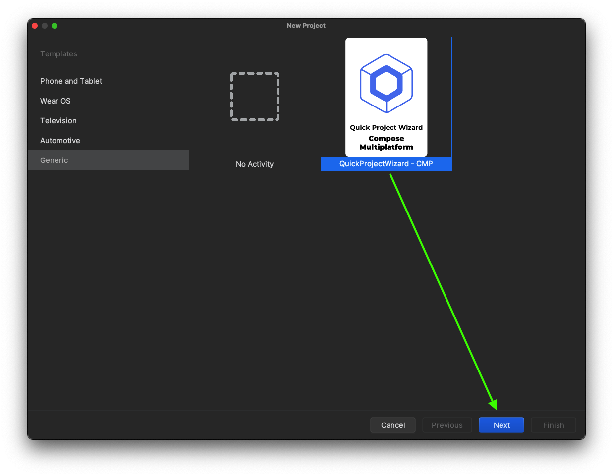

# QuickProjectWizard


[](https://plugins.jetbrains.com/plugin/25221)
[](https://plugins.jetbrains.com/plugin/25221)


[Documentation](https://quickprojectwizard.candroid.dev/tutorials/project-wizard/)

<!-- Plugin description -->

#### The ultimate Android development companion that simplifies project setup and provides powerful development tools. Create new projects with modern dependencies, manage modules and features, and access essential utilities - all from a single, intuitive interface.

🚀 **Project Templates** • 🏗️ **Module & Feature Generation** • 🎨 **Development Tools** • ⚙️ **Team Collaboration**

<!-- Plugin description end -->

## ✨ Features Overview

### 🚀 Project Creation

- **Compose & XML Templates**: Modern Android project setup with latest dependencies
- **Compose Multiplatform**: Cross-platform projects for Android, iOS, Desktop, and Web
- **Smart Dependency Management**: Automatic library integration and configuration
- **Clean Architecture**: Pre-configured project structure with best practices

### 🏗️ Module & Feature Management

- **Module Generator**: Create new modules with customizable templates
- **Feature Scaffolding**: Generate complete features with data, domain, and UI layers
- **Code Migration**: Move existing files into proper module structure
- **Template System**: Custom templates for consistent code generation

### 🎨 Development Tools

- **System Color Picker**: Professional color selection with magnification
- **JSON/XML Formatter**: Format and validate data with syntax highlighting
- **API Tester**: Built-in HTTP client for testing APIs
- **File Tree Browser**: Visual directory navigation and selection

### ⚙️ Configuration & Settings

- **Template Management**: Create, edit, and share custom templates
- **Settings Sync**: Automatic backup and restore across updates
- **Team Collaboration**: Import/export settings for consistent team setup
- **Cross-Platform Support**: Works seamlessly on Windows, macOS, and Linux

---

## 📦 Installation

<details>
<summary><b>🛍️ From JetBrains Marketplace (Recommended)</b></summary>

1. Open Android Studio
2. Go to **Settings/Preferences** → **Plugins** → **Marketplace**
3. Search for **"QuickProjectWizard"**
4. Click **Install** and restart IDE

Or visit [JetBrains Marketplace](https://plugins.jetbrains.com/plugin/25221-quickprojectwizard) directly.

</details>

<details>
<summary><b>📁 Manual Installation</b></summary>

1. Download the [latest release](https://github.com/cnrture/QuickProjectWizard/releases/latest)
2. Go to **Settings/Preferences** → **Plugins** → **⚙️** → **Install plugin from disk...**
3. Select the downloaded file and restart IDE

</details>

---

## 🎯 Quick Start Guide

### 1️⃣ Creating New Projects

#### 🎨 Compose Projects


#### 📱 XML Projects


#### 🌍 Compose Multiplatform



**Steps:**

1. **File** → **New** → **Project**
2. Select **Quick Project Wizard**
3. Choose your template (Compose/XML/Multiplatform)
4. Configure project details and dependencies
5. Click **Finish** and start coding! 🚀

### 2️⃣ Accessing Development Tools

Open the tool window: **View** → **Tool Windows** → **QuickProjectWizard**


---

## 🛠️ Development Tools Deep Dive

### 🏗️ Module Generator

Create and organize your project modules efficiently:

**Features:**

- ✅ **New Module Creation**: Generate modules with clean architecture
- ✅ **File Migration**: Move existing code into proper module structure
- ✅ **Dependency Detection**: Automatic library dependency resolution
- ✅ **Template Customization**: Use built-in or custom templates
- ✅ **Multi-Module Support**: Handle complex project structures

**Usage:**

1. Open QuickProjectWizard tool window
2. Navigate to **Module Generator** tab
3. Choose **Create New** or **Move Existing Files**
4. Configure module settings and select dependencies
5. Generate your module with one click!

### ⚡ Feature Generator

Rapidly scaffold complete features with consistent architecture:

**Generated Structure:**

```
feature/
├── data/
│   ├── repository/
│   ├── datasource/
│   └── dto/
├── domain/
│   ├── usecase/
│   ├── repository/
│   └── model/
└── presentation/
    ├── ui/
    ├── viewmodel/
    └── contract/
```

**Benefits:**

- 🎯 **MVVM Architecture**: Clean separation of concerns
- 🔄 **Compose Integration**: Modern UI with state management
- 📝 **Custom Templates**: Modify templates to match your coding style
- 🚀 **Rapid Development**: Generate complete features in seconds

### 🎨 Color Picker

Professional color selection tool integrated into your IDE:

**Features:**

- 🔍 **System-Wide Picking**: Select colors from anywhere on screen
- 🔎 **Magnification**: Pixel-perfect precision with zoom view
- 📋 **Multiple Formats**: Copy as HEX, RGB, HSV, or HSL
- 📚 **Color History**: Quick access to recently used colors
- ⌨️ **Keyboard Shortcuts**: Efficient workflow integration

**Perfect for:**

- UI/UX color scheme creation
- Matching colors from designs
- Brand color consistency
- Material Design palette generation

### 🧰 JSON/XML Formatter

Format and validate your data with professional tools:

**Capabilities:**

- ✨ **Smart Formatting**: Proper indentation and structure
- ✅ **Syntax Validation**: Real-time error detection
- 🎨 **Syntax Highlighting**: Color-coded for better readability
- 💾 **State Persistence**: Remembers your content across sessions
- ⚡ **Instant Processing**: Real-time formatting as you type

### 🌐 API Tester

Built-in HTTP client for testing APIs without leaving your IDE:

**Features:**

- 🔗 **All HTTP Methods**: GET, POST, PUT, DELETE, PATCH, etc.
- 📝 **Request Builder**: Headers, query parameters, body content
- 📊 **Response Analysis**: Status codes, headers, formatted body
- 📚 **Request History**: Quick access to previous requests
- 💾 **Session Persistence**: Saves state between IDE restarts

**Sample Endpoints:**

- Weather API: `https://api.openweathermap.org/data/2.5/weather`
- JSONPlaceholder: `https://jsonplaceholder.typicode.com/posts`
- Harry Potter API: `https://api.canerture.com/harrypotterapp/characters`

---

## ⚙️ Settings & Customization

### 📋 Template Management

Create and manage custom templates for consistent code generation:

**Module Templates:**

- Customize file structure and content
- Use placeholders: `{NAME}`, `{PACKAGE}`, `{FILE_PACKAGE}`
- Share templates with your team
- Import/export template collections

**Template Placeholders:**

- `{NAME}` → File name without extension
- `{PACKAGE}` → Base package name (e.g., com.example.app)
- `{FILE_PACKAGE}` → Full package path (e.g., com.example.app.feature.home)

### 🔄 Settings Synchronization

Never lose your configurations again:

**Auto-Backup System:**

- ✅ **Automatic Export**: Every setting change is backed up
- ✅ **Cross-Platform**: Works on Windows, macOS, and Linux
- ✅ **Update Safe**: Settings persist through plugin updates
- ✅ **Team Sharing**: Export/import for team consistency

**Backup Location:**

- **Windows**: `C:\Users\{username}\.quickprojectwizard\settings.json`
- **macOS**: `/Users/{username}/.quickprojectwizard/settings.json`
- **Linux**: `/home/{username}/.quickprojectwizard/settings.json`

### 👥 Team Collaboration

Share configurations across your development team:

1. **Export Settings**: Generate settings file from your configuration
2. **Share File**: Distribute via Git, Slack, or email
3. **Import Settings**: Team members import your configuration
4. **Consistent Setup**: Everyone uses the same templates and preferences

---

## 🚀 Advanced Usage

### 🎯 Custom Project Templates

Create your own project templates:

1. Set up a project with your preferred structure
2. Create custom module and feature templates
3. Configure default settings and dependencies
4. Export and share with your team

### 🔧 Integration with Existing Projects

Add QuickProjectWizard to existing projects:

1. Use **Module Generator** to create new modules
2. Migrate existing code with the **File Migration** tool
3. Generate new features with consistent architecture
4. Maintain code quality with custom templates

### ⚡ Productivity Tips

**Keyboard Shortcuts:**

- Quick access to tool window
- Rapid template application
- Fast color picking workflows

**Best Practices:**

- Use consistent naming conventions
- Leverage template placeholders effectively
- Maintain team template libraries
- Regular settings backup and sync

---

## 🤝 Contributing

We welcome contributions! Here's how you can help:

- 🐛 **Report Bugs**: [Create an issue](https://github.com/cnrture/QuickProjectWizard/issues)
- 💡 **Suggest Features**: Share your ideas for improvements
- 🔧 **Code Contributions**: Submit pull requests
- 📖 **Documentation**: Help improve guides and tutorials
- ⭐ **Spread the Word**: Star the repository and share with others

---

## 📄 License

This project is licensed under the MIT License - see the [LICENSE](LICENSE) file for details.

---

## 🙏 Acknowledgments

- Built with the [IntelliJ Platform Plugin Template](https://github.com/JetBrains/intellij-platform-plugin-template)
- Inspired by the Android developer community
- Thanks to all contributors and users for their feedback

---

## This Text is also available in

[[English](https://img.shields.io/badge/EN-⚫-green.svg)]()

[](locals/tr.md) 

---

## 📞 Support

- 📧 **Email**: cnrture@gmail.com
- 🌐 **Website**: [canerture.com](https://canerture.com)
- 💬 **Discussions**: [GitHub Discussions](https://github.com/cnrture/QuickProjectWizard/discussions)
- 🐛 **Issues**: [GitHub Issues](https://github.com/cnrture/QuickProjectWizard/issues)

---

<div align="center">

**Made with ❤️ by [Caner Türe](https://github.com/cnrture)**

[⭐ Star this project](https://github.com/cnrture/QuickProjectWizard) • [🍴 Fork it](https://github.com/cnrture/QuickProjectWizard/fork) • [📥 Download](https://plugins.jetbrains.com/plugin/25221-quickprojectwizard)

</div>
