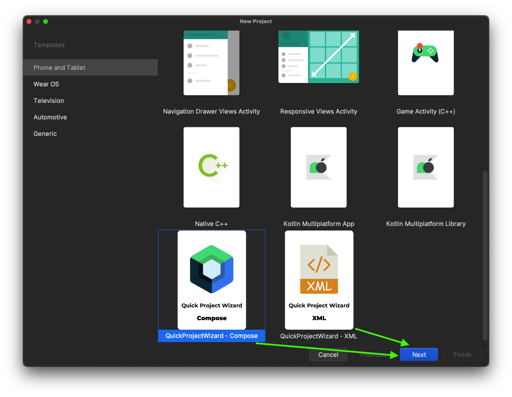
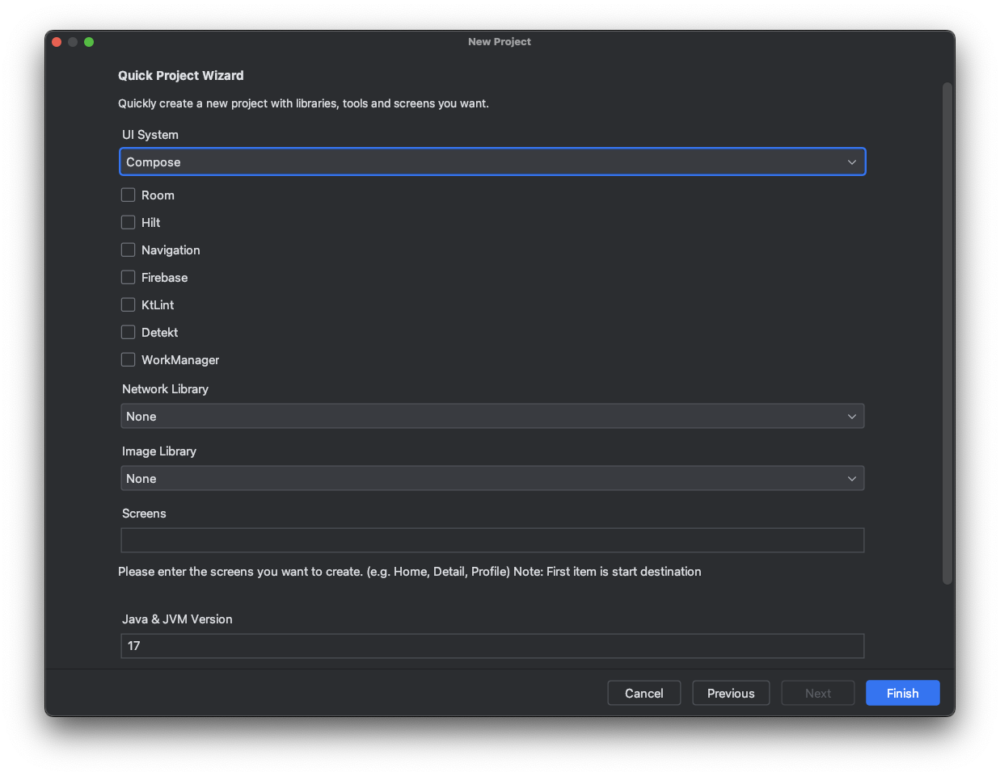
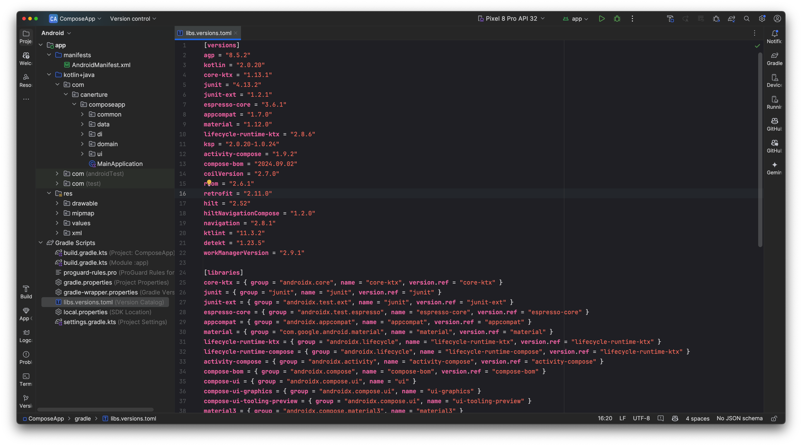

# QuickProjectWizard

## Template ToDo list
- [x] Create a new [IntelliJ Platform Plugin Template][template] project.
- [ ] Get familiar with the [template documentation][template].
- [ ] Adjust the [pluginGroup](./gradle.properties) and [pluginName](./gradle.properties), as well as the [id](./src/main/resources/META-INF/plugin.xml) and [sources package](./src/main/kotlin).
- [ ] Adjust the plugin description in `README` (see [Tips][docs:plugin-description])
- [ ] Review the [Legal Agreements](https://plugins.jetbrains.com/docs/marketplace/legal-agreements.html?from=IJPluginTemplate).
- [ ] [Publish a plugin manually](https://plugins.jetbrains.com/docs/intellij/publishing-plugin.html?from=IJPluginTemplate) for the first time.
- [ ] Set the `MARKETPLACE_ID` in the above README badges. You can obtain it once the plugin is published to JetBrains Marketplace.
- [ ] Set the [Plugin Signing](https://plugins.jetbrains.com/docs/intellij/plugin-signing.html?from=IJPluginTemplate) related [secrets](https://github.com/JetBrains/intellij-platform-plugin-template#environment-variables).
- [ ] Set the [Deployment Token](https://plugins.jetbrains.com/docs/marketplace/plugin-upload.html?from=IJPluginTemplate).
- [ ] Click the <kbd>Watch</kbd> button on the top of the [IntelliJ Platform Plugin Template][template] to be notified about releases containing new features and fixes.

<!-- Plugin description -->
This Fancy IntelliJ Platform Plugin is going to be your implementation of the brilliant ideas that you have.

This specific section is a source for the [plugin.xml](/src/main/resources/META-INF/plugin.xml) file which will be extracted by the [Gradle](/build.gradle.kts) during the build process.

To keep everything working, do not remove `<!-- ... -->` sections. 
<!-- Plugin description end -->

## Installation

- Using the IDE built-in plugin system:
  
  <kbd>Settings/Preferences</kbd> > <kbd>Plugins</kbd> > <kbd>Marketplace</kbd> > <kbd>Search for "QuickProjectWizard"</kbd> >
  <kbd>Install</kbd>
  
- Using JetBrains Marketplace:

  Go to [JetBrains Marketplace](https://plugins.jetbrains.com/plugin/MARKETPLACE_ID) and install it by clicking the <kbd>Install to ...</kbd> button in case your IDE is running.

  You can also download the [latest release](https://plugins.jetbrains.com/plugin/MARKETPLACE_ID/versions) from JetBrains Marketplace and install it manually using
  <kbd>Settings/Preferences</kbd> > <kbd>Plugins</kbd> > <kbd>⚙️</kbd> > <kbd>Install plugin from disk...</kbd>

- Manually:

  Download the [latest release](https://github.com/cnrture/QuickProjectWizard/releases/latest) and install it manually using
  <kbd>Settings/Preferences</kbd> > <kbd>Plugins</kbd> > <kbd>⚙️</kbd> > <kbd>Install plugin from disk...</kbd>

## Usage

### 1. Create a new project

- Open your Android Studio.
- Click New Project.
- Select Quick Project Wizard and click Next.
  

### 2. Configure your project

- Select the libraries, dependencies and screens you want to include in your project (for example, Retrofit, Room, Hilt, etc.).
- Customize versions and additional configurations.
- After all selections have been made, click Finish.
  

### 3. Finalize and start coding

- Review the generated project structure to ensure all necessary dependencies and configurations are correctly applied.
- Start coding your new project with all the essential tools and libraries already integrated.
- Congratulations! You have successfully installed and configured the Quick Project Wizard plugin. Your new Android project is now set up with the latest and most essential dependencies, making your development process more efficient and streamlined.

---
Plugin based on the [IntelliJ Platform Plugin Template][template].

[template]: https://github.com/JetBrains/intellij-platform-plugin-template
[docs:plugin-description]: https://plugins.jetbrains.com/docs/intellij/plugin-user-experience.html#plugin-description-and-presentation
