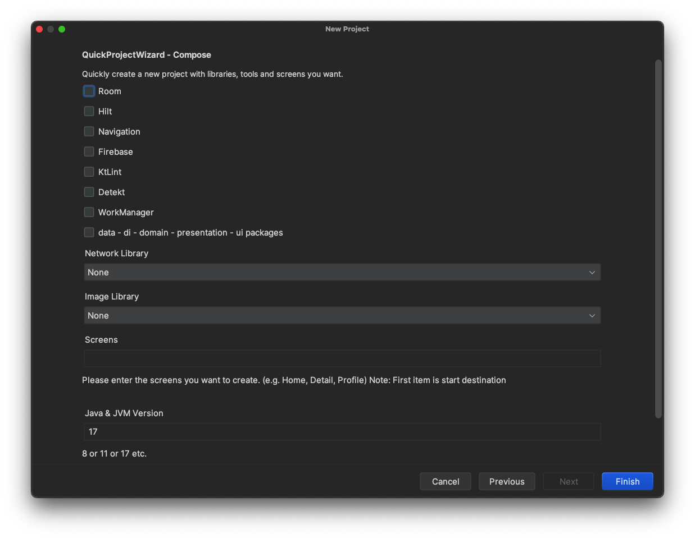

# QuickProjectWizard

<!-- Plugin description -->
#### This plugin simplifies the process of setting up a new Android project with all the necessary dependencies and configurations.
- Popular libraries and frameworks
- Compose, XML and Compose Multiplatform templates
- data, di, domain, ui, and common packages
<!-- Plugin description end -->

## Installation

- Using the IDE built-in plugin system:
  
  <kbd>Settings/Preferences</kbd> > <kbd>Plugins</kbd> > <kbd>Marketplace</kbd> > <kbd>Search for "QuickProjectWizard"</kbd> >
  <kbd>Install</kbd>
  
- Using JetBrains Marketplace:

  Go to [JetBrains Marketplace](https://plugins.jetbrains.com/plugin/25221-quickprojectwizard) and install it by clicking the <kbd>Install to ...</kbd> button in case your IDE is running.

  You can also download the [latest release](https://plugins.jetbrains.com/plugin/25221-quickprojectwizard/versions) from JetBrains Marketplace and install it manually using
  <kbd>Settings/Preferences</kbd> > <kbd>Plugins</kbd> > <kbd>⚙️</kbd> > <kbd>Install plugin from disk...</kbd>

- Manually:

  Download the [latest release](https://github.com/cnrture/QuickProjectWizard/releases/latest) and install it manually using
  <kbd>Settings/Preferences</kbd> > <kbd>Plugins</kbd> > <kbd>⚙️</kbd> > <kbd>Install plugin from disk...</kbd>

# Usage

## 1. Create a new project

### Compose and XML

### Compose Multiplatform

- Open your Android Studio.
- Click New Project.
- Select Quick Project Wizard and click Next.
  

## 2. Configure your project

### Compose and XML

### Compose Multiplatform

- Select the libraries, dependencies and screens you want to include in your project (for example, Retrofit, Room, Hilt, etc.).
- Customize versions and additional configurations.
- After all selections have been made, click Finish.
  

## 3. Finalize and start coding

### Compose and XML

### Compose Multiplatform

- Review the generated project structure to ensure all necessary dependencies and configurations are correctly applied.
- Start coding your new project with all the essential tools and libraries already integrated.
- Congratulations! You have successfully installed and configured the Quick Project Wizard plugin. Your new Android project is now set up with the latest and most essential dependencies, making your development process more efficient and streamlined.

## 4. Configure edit configurations (Just Compose Multiplatform)

- Open edit configurations.

- Write your composeApp path instead of "\${PROJECT_DIR}\$" (like : ~/Documents/GitHub/CMPApp/composeApp)

- Select Apple device from Execution Target.
---
Plugin based on the [IntelliJ Platform Plugin Template][template].

[template]: https://github.com/JetBrains/intellij-platform-plugin-template
[docs:plugin-description]: https://plugins.jetbrains.com/docs/intellij/plugin-user-experience.html#plugin-description-and-presentation
